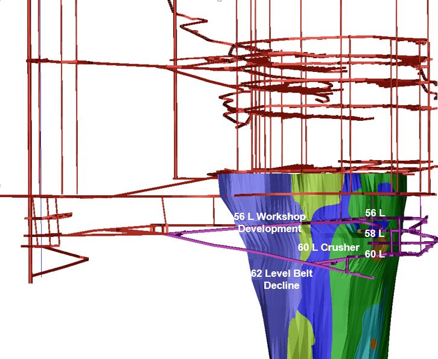

### 1. Document Overview

#### 1.1 Project description

Koffiefontein Diamond Mine (KDM) is a three tier sublevel cave operation based in the Free state province, SOuth Africa. The idea of this project was to utilise the data that is available at the operation and fit supervised regression models on the dielineated exogenous variables. After the optimal model was selected, the prediciton algorithm was implemented into production. The endogenous predicitons and the exogenous variables were then displyed in the control room and on management dashboards so that process control could be applied.    

#### 1.2 Objectives discussed in this document

* Delineate best model that minimises the Root Mean Squared Error (RMSE).
* Put model into production using real-time data so that relevant stakholders have sight on hourly prediction  for the remaining shift and production day.

#### 1.3 Assumption

* The data on the on-mine servers are of acceptable quality.

#### 1.4 Packages utiliised

tidyr, caret, ranger, vtreat, xgboost, magrittr, ggplot2, dplyr, broom, knitr, rmarkdown

#### 1.5 Sublevel cave


```{r echo=TRUE}

```


### 2. Methodology

#### 2.1 Delineate variables

Hourly data for February and March 2020:
 
* Hour
* Day of week
* Number of operators underground
* Number of LHDs Loading
* 56 level West orientation loading percentage
* 58 level East orientation loading percentage
* 58 level RLT orientation loading percentage
* 60 level East orientation loading percentage
* 60 level West orientation loading percentage
* Ore pass levels (Not available)

#### 2.2 Endogenous varariable

* Buckets by hour

#### 2.3 Data preperation

Prepared in SQL using:

	- Loading data table from underground LHD monitoring system 
	- Employee scanner clocking System


```{r echo=TRUE}
KDMTrainCSV <- read.csv("~/GitHub/R/DataSets/KDMTrainCSV.csv")
str(KDMTrainCSV)
summary(KDMTrainCSV)
```


