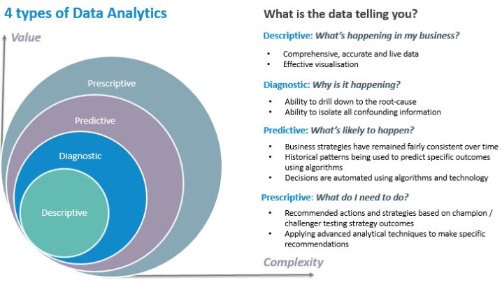

## {.tabset}

### Overview

#### Background for projects

Koffiefontein Diamond Mine (KDM) is a three tier sub-level cave operation based in the Free state province, South Africa. Recent developments at the mine has led to various technological systems being implemented rendering vast amounts of data. The mine utilises business Intelligence software, which is intuitive, but more descriptive than predictive. The idea of the projects, detailed in the tabs above, were to better understand the machine learning possibilities with incumbent data availability and quality. 
 
Predictive insights and variation of components influencing dependent variables give on-mine decision maker a better chance of control based on historically observed data. The aim of the projects were to fit supervised regression/classification models on the applicable, delineated, independent variables. After the optimal models were selected, the prediction algorithms were implemented into production. The dependent predictions and the independent variables were then displayed in the control room and on management dashboards for improved process control. 

#### Sub-level cave

```{r echo=FALSE}
# Include image
knitr::include_graphics("KDM Levels.JPG")
```

#### Assumptions

* Available data on the on-mine servers are of acceptable quality.
* Reader of this document has basic understanding of supervised learning and why these regression models were used.
* Reader has basic familiarity with sub-level cave mining.

#### Packages utilised

tidyr, caret, ranger, vtreat, xgboost, magrittr, ggplot2, dplyr, broom, knitr, rmarkdown

#### Author
**Jacques Swart** 

**Email address:** Jacques.swart@petradiamonds.com 


### Loading


#### Objectives for this project

* Delineate best model that minimises the Root Mean Square Error (RMSE).
* Put model into production using (near) real-time data so that relevant stakeholders have sight on hourly prediction  for the remaining shift and production day.
* Push underperfroming independent variables to screens for process control.

#### Independent variables

Hourly data for February and March 2020:
 
* Hour of day
* Day of week
* Number of operators underground
* Number of LHDs Loading
* 56 level West orientation loading percentage
* 58 level East orientation loading percentage
* 58 level RLT orientation loading percentage
* 60 level East orientation loading percentage
* 60 level West orientation loading percentage
* 56 level ring meters drilled past month
* 58 level ring meters drilled past month
* 60 level ring meters drilled past month
* Ore pass levels (Not available)

#### Dependent variable

* Buckets by hour

#### Data preparation

Prepared in SQL using:

	- Loading data table from underground LHD monitoring system 
	- Employee scanner clocking System


```{r echo=TRUE}
# Read train data and inspect (February 2020)
KDMTrainCSV <- read.csv("~/GitHub/R/DataSets/KDMTrainCSV.csv")
str(KDMTrainCSV)
summary(KDMTrainCSV)
```

#### 2.4 Data visualisation


```{r}
# Understand correlation between variables
library(corrplot)
df<-as.matrix(KDMTrainCSV)
dfPairs <- df[,2:11]
dfPairs.cor<-cor(dfPairs)
corrplot(dfPairs.cor,method="number")
```


```{r echo=TRUE}
# Load required libraries
library(magrittr)
library(dplyr)
library(ggplot2)
# Create data frame that groups the train data by hour
ByHourDF <- KDMTrainCSV %>%
group_by(Hour)
# Render distinct LHDs utilised by hour
ggplot(ByHourDF, aes(x=factor(Hour),y=LHDs))+geom_boxplot()
# Render faceted graph showing buckets by week day by hour 
  p1<-ggplot(data=KDMTrainCSV,aes(Hour,y=Buckets))+geom_point()+geom_smooth()
p1 +     facet_wrap( ~ WeekDay, nrow = 1) + theme(legend.position = "none") + ggtitle("Hourly Buckets by Weekday")
```


#### 2.5 Compare algorithms for fit on train and Test data

```{r}
mean(KDMTrainCSV$Buckets)
var(KDMTrainCSV$Buckets)
```

var >> mean 

Will therefore use Quasipoisson and not Poisson

Models:
 
* Model1 = Quasipoisson
* Model2 = Random forest
* Model3 - XGBoost

```{r}
# Test data as well (March 2020)
KDMTestCSV <- read.csv("~/GitHub/R/DataSets/KDMTestCSV.csv")
```


```{r}
# Model quasipoisson
formula <- KDMTrainCSV$Buckets~.-Instant
model1 <- glm(formula,data=KDMTrainCSV,family=quasipoisson)
# Predict on test data
pred1<-predict(model1,newdata=KDMTestCSV,type="response")
summary(pred1)
# Calculate RMSE
KDMTestCSV %>%
mutate(residual = pred1 - Buckets) %>%
summarise(rmse=sqrt(mean(residual^2)))
```


```{r}
# Model random forest
library(ranger)
set.seed(1)
formula <- KDMTrainCSV$Buckets~.-Instant
model2 <- ranger(formula,KDMTrainCSV,num.trees=500,respect.unordered.factors = "order")
# Predict on test data
KDMTestCSV$pred2 <- predict(model2,KDMTestCSV)$predictions
summary(KDMTestCSV$pred2)
# Calculate RMSE
KDMTestCSV %>%
mutate(residual = pred2 - Buckets) %>%
summarise(rmse=sqrt(mean(residual^2)))
```


```{r}
# Model XGBoost
library(xgboost)
library(vtreat)
set.seed(1)
(outcome <- "Buckets")
(vars <- c("Weekday", "Hour", "Operators", "LHDs", "X56.W","X58.E","X58.R","X60.E","X60.W"))
treatplan <- designTreatmentsZ(KDMTrainCSV,vars,verbose = FALSE)
# Get the "clean" and "lev" variables from the scoreFrame
(newvars <- treatplan %>%
use_series(scoreFrame) %>%
filter(code %in% c("clean","lev")) %>%
use_series(varName))
# Prepare data  frames with new variables
KDMTrainCSV.treat <- prepare(treatplan,KDMTrainCSV, varRestriction = newvars)
KDMTestCSV.treat <- prepare(treatplan,KDMTestCSV, varRestriction = newvars)
#
cv <- xgb.cv(data = as.matrix(KDMTrainCSV.treat),
label = KDMTrainCSV$Buckets,
nrounds = 100,
nfold = 5,
objective = "reg:linear",
eta = 0.3,
max_depth = 6,
early_stopping_rounds = 10,
verbose = 0   # silent
)
# Get evaluation log
elog <- cv$evaluation_log
#Detrmine amount of trees minimising trees for train and test
elog %>%
summarize(ntrees.train = which.min(train_rmse_mean),   # find the index of min(train_rmse_mean)
ntrees.test  = which.min(test_rmse_mean))    # find the index of min(test_rmse_mean)
```
```{r}
#Use optimal tree

Buckets_model_xgb <- xgboost(data = as.matrix(KDMTrainCSV.treat), # training data as matrix
label = KDMTrainCSV$Buckets,  # column of outcomes
nrounds = 24,       # number of trees to build
objective = "reg:linear", # objective
eta = 0.3,
depth = 6,
verbose = 0  # silent
)
# Make predictions
KDMTestCSV$pred3 <- predict(Buckets_model_xgb,as.matrix(KDMTestCSV.treat))
# Calculate RMSE
KDMTestCSV %>%
mutate(residual = pred3 - Buckets) %>%
summarise(rmse=sqrt(mean(residual^2)))

```


**Random forest model yields the lowest RMSE and is selected**


#### 2.6 Visualise prediction versus actuals for test data

model 2 selected

```{r}
#Plot prediction versus actual for test data
ggplot(KDMTestCSV, aes(x=pred2,y=Buckets))+
geom_point()+
geom_abline()
```


```{r}
#Plot prediction versus actual for test data example
library(tidyr)
# Week
first_two_weeks <- KDMTestCSV %>% 
  # Set start to 0, convert unit to days
  mutate(Instant = (Instant - min(Instant)) / 24) %>% 
  # Gather Buckets and pred2 into a column named value with key valuetype
  gather(key = valuetype, value = value, Buckets, pred2) %>%
  # Filter for rows 
  filter(Instant < 14 ) 

# Plot predictions and Buckets by date/time 
ggplot(first_two_weeks, aes(x = Instant, y = value, color = valuetype, linetype = valuetype)) + 
  geom_point() + 
  geom_line() + 
  scale_x_continuous("Day", breaks = 0:14, labels = 0:14) + 
  scale_color_brewer(palette = "Dark2") + 
  ggtitle("Predicted Two Weeks Buckets, Random Forest plot")

# Specific day: 10 March 2020
Specific_day <- KDMTestCSV %>% 
  # Set start to 0, convert unit to days
  mutate(instant = (Instant - min(Instant))) %>% 
  # Gather Buckets and pred2 into a column named value with key valuetype
  gather(key = valuetype, value = value, Buckets, pred2) %>%
  # Filter for rows 
  filter(Instant <= 10*24 & Instant > 9*24)

#Plot predictions and Buckets by date/time 
ggplot(Specific_day, aes(x = Instant, y = value, color = valuetype, linetype = valuetype)) + 
  geom_point() + 
  geom_line() + 
  scale_x_continuous("Hour", breaks = 0:14, labels = 0:14) + 
  scale_color_brewer(palette = "Dark2") + 
  ggtitle("Predicted 10 March 2020 Buckets, Random Forest plot")

```


The model that has been elicited makes it possible to predict on hourly data. It will be put into production using SQLMachine learning services. The current hour's prediction will be based on the real-time quantities of the independent variables. 

The remaining hours of the production day will be predicted using the last two rolling month's average for the quantity of operators and the quantity of LHDs for each hour on each weekday. The percentage extraction from each level and orientation will be based on the split of the called tonnes by the planner before each production day. Drilling meters by level will be actuals. 


**Performance of the model will be discussed once operations are 100% operational again** 


### Grade

**Update 20200504**
Complete, documenting in progress 
 

### Multivariate

**Update 20200504**
Complete,  documenting in progress 


**Multiple multivariate regression**
Include grade and compliance (available from March) as dependent variables
Grade data lags loading data by n day

Packages:
MultivariateRandomForest
IntegratedMRF


### Optimisation

**Predictive to prescriptive**
 
Interesting reading: predicitve (machine learning) to prescriptive (operations research) 
 
https://arxiv.org/pdf/1402.5481.pdf 
 
https://www.funartech.com/approach/hybridization


```{r ,echo=FALSE}
# Include image

```

Four pillars for the financial success of a block already in production: 
 
* Amount of tonnes treated
* Grade recovered
* Draw compliance
(Extensive mine planning is performed by mining engineers and geologists to maximise the block that has been developed. Deviation from the compliance to mine less expensive, easier or higher grade ore deminishes the value of the Life of Mine (LoM) in the long run) 
* Cash cost of production

All the above mentioned pillars can be modelled as dependent variables.


### Notes


Improvement suggestion (Perhaps at CDM):
Ore pass levels could be a significant variable to incorporate that potentially improves predictions as it is a sound representation of the ore handling system's performance and directly impact dumping ability if full. 


**Include meters drilled by level**
Covariate analyse on loading and grade to determine time frame for drilling data


**Grade prediction**
Build model and predict (data at tunnel level will be required at least)
Grade will predicited on daily basis, but repredicitons will occur hourly for production day when model in production.


Suggested dependent variables


**Other**

Minise loss function


